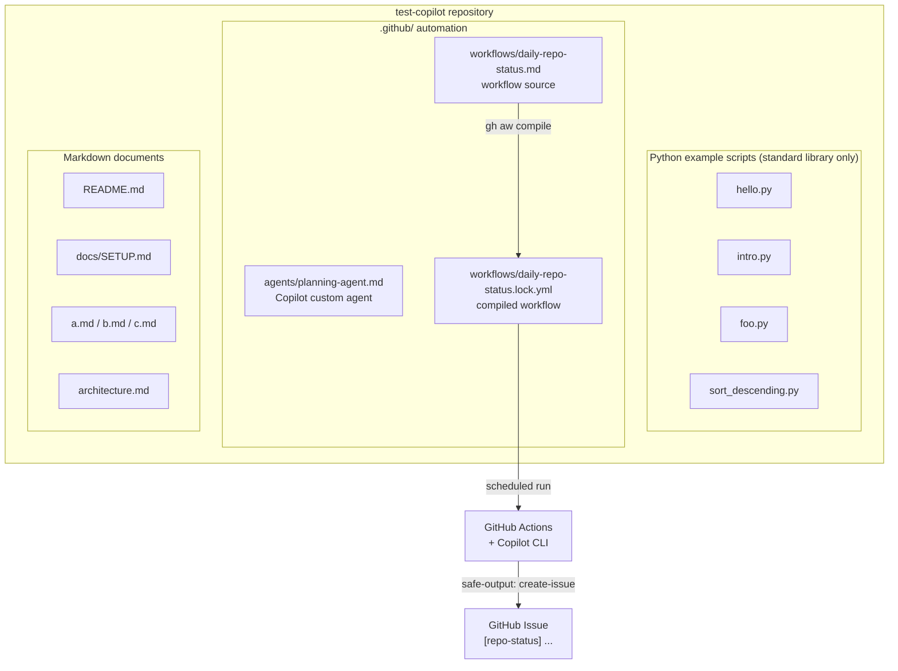

# Architecture

## Overview

`test-copilot` is a sandbox repository used to exercise and demonstrate GitHub
Copilot features (custom agents, agentic workflows, and code generation).

It is **not** a deployable application. There is no build system, no package
manifest, no test suite, and no shared runtime. The repository contains two
independent things:

1. A set of small, self-contained **Python example scripts**, each runnable on
   its own with the standard library.
2. **GitHub-side automation** under `.github/` — a Copilot custom agent
   definition and a scheduled agentic workflow that reports on repo activity.

These two parts do not import, call, or depend on each other.

## High-Level Component Structure



## Directory Layout

```
test-copilot/
├── .github/
│   ├── agents/
│   │   └── planning-agent.md            # Copilot custom agent definition
│   └── workflows/
│       ├── daily-repo-status.md         # agentic workflow source (frontmatter + prompt)
│       └── daily-repo-status.lock.yml   # generated by `gh aw compile` — do not edit
├── docs/
│   └── SETUP.md                         # setup notes (see "Documentation drift")
├── .gitattributes                       # marks *.lock.yml generated, merge=ours
├── README.md                            # project overview (see "Documentation drift")
├── architecture.md                      # this file
├── a.md, b.md, c.md                     # placeholder/lorem-ipsum test files
├── hello.py                             # prints "Hello"
├── intro.py                             # prints "Hello, World!"
├── foo.py                               # random string, Fibonacci, palindrome helpers
└── sort_descending.py                   # descending sort + interactive CLI
```

## Python Scripts

Every script is standalone, has no imports from the other scripts, and is run
directly with `python3 <file>.py`. Only the standard library is used
(`random`, `string`).

| File | Public functions | Behavior when run directly |
| --- | --- | --- |
| `hello.py` | — | Prints `Hello`. |
| `intro.py` | — | Prints `Hello, World!`. |
| `foo.py` | `generate_random_string(length=10)`, `fibonacci(n)`, `is_palindrome(s)` | Demo block prints a random string, the first 10 Fibonacci numbers, and two palindrome checks. |
| `sort_descending.py` | `sort_numbers_descending(numbers)` | Reads space-separated integers from `stdin` via `input()`, prints them sorted descending. |

Both `foo.py` and `sort_descending.py` guard their demo code with
`if __name__ == "__main__":`, so their functions can also be imported without
side effects.

### Control flow (`sort_descending.py`)

```
stdin ──> input() ──> str.split() ──> [int(...)] ──> sorted(reverse=True) ──> print()
```

`sort_numbers_descending` is a thin wrapper over the built-in `sorted()` with
`reverse=True`; it returns a new list and does not mutate its argument.

## GitHub Automation

### Copilot custom agent — `.github/agents/planning-agent.md`

A markdown agent definition with YAML frontmatter (`name`, `description`). The
body is the system prompt for a "Planning Agent" that turns feature ideas into
PRDs and sequenced task breakdowns. It is consumed by Copilot when the agent is
selected; nothing in this repo invokes it programmatically.

### Agentic workflow — `.github/workflows/daily-repo-status.*`

This uses [`gh-aw`](https://github.com/github/gh-aw) (GitHub Agentic Workflows).
The authored source is markdown; the runnable GitHub Actions YAML is compiled
from it.

- **Source:** `daily-repo-status.md` — frontmatter declares the schedule
  (`daily` + `workflow_dispatch`), read-only `permissions` for contents/issues/
  pull-requests, the `github` tool, and a `safe-outputs.create-issue` contract
  with title prefix `[repo-status] ` and labels `report`, `daily-status`. It is
  vendored from
  `githubnext/agentics/workflows/daily-repo-status.md`. The markdown body is the
  prompt telling the agent to summarize recent repo activity.
- **Compiled artifact:** `daily-repo-status.lock.yml`, generated by
  `gh aw compile` (gh-aw v0.40.0). It is regenerated, never hand-edited — hence
  the `.gitattributes` entry marking it `linguist-generated=true merge=ours`.
  The concrete cron is `17 23 * * *`.

Job graph in the compiled workflow:

```
activation ──> agent ──> detection ──┐
                  │                  ├──> safe_outputs ──> conclusion
                  └──────────────────┘
```

- `activation` — validates workflow file timestamps before anything runs.
- `agent` — installs the Copilot CLI, runs it inside a firewalled sandbox
  (egress restricted to an explicit domain allowlist) with the compiled prompt.
- `detection` — threat-detection pass over the agent's output.
- `safe_outputs` — turns the agent's declared safe output into the actual
  GitHub issue. The agent never gets write permissions directly.
- `conclusion` — final status reporting.

## External Dependencies and Integrations

- **Python 3** standard library only. No `requirements.txt`, `pyproject.toml`,
  `setup.py`, or lockfile; nothing to install.
- **No JavaScript/Node project.** There is no `package.json` anywhere in the
  repository.
- **GitHub Actions** — the only automated execution environment.
- **GitHub Copilot CLI** (pinned to `0.0.400` in the compiled workflow) — the
  agent engine (`GH_AW_ENGINE="copilot"`), authenticated via the
  `COPILOT_GITHUB_TOKEN` secret.
- **`gh-aw`** — the compiler and runtime actions for the agentic workflow.
- **GitHub Issues API** — the workflow's only write-side effect, reached
  indirectly through the `safe_outputs` job.

## Notable Design Decisions

- **No shared runtime or package structure.** Scripts are deliberately isolated
  single-file examples rather than a cohesive module, which matches the
  repository's purpose as a Copilot testing ground.
- **Standard library only.** Keeps every example runnable with a bare `python3`
  install and no setup step.
- **Importable functions, guarded demos.** `__main__` guards let the scripts act
  as both runnable demos and importable helpers.
- **Compiled-artifact workflow model.** The workflow is authored as markdown and
  compiled to YAML. The `merge=ours` git attribute prevents merge conflicts in
  the generated file; regeneration is the only supported way to change it.
- **Least privilege for the agent.** The workflow grants read-only permissions
  and routes all writes through the `safe-outputs` contract, with a separate
  threat-detection job and network egress allowlisting.

## Documentation Drift

Some existing markdown does not describe this repository's actual contents.
Treat the code as the source of truth:

- `README.md` instructs `npm install`, but there is no Node project or
  `package.json`.
- `docs/SETUP.md` describes a "Social App" with Node.js, MongoDB, JWT auth, and
  Socket.IO real-time chat. None of that code exists here.
- `a.md`, `b.md`, and `c.md` are lorem-ipsum placeholders with no functional role.
